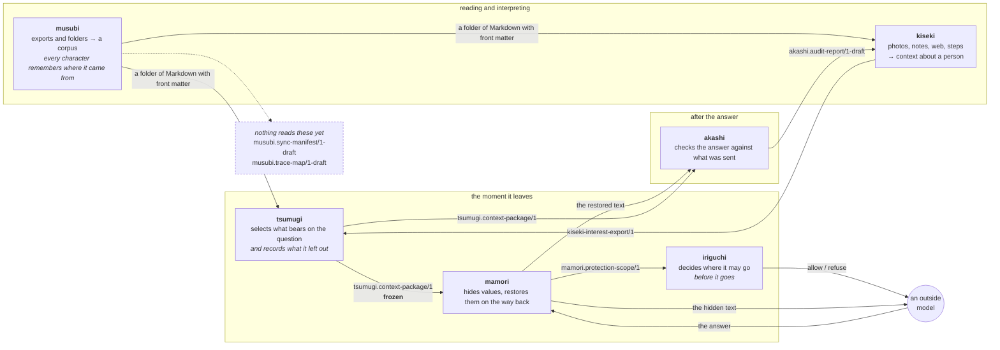

# musubi（結び）

**Local-first ingestion for generative AI.** Turn the exports and folders you
already have — an Obsidian vault, a Notion zip, a Slack archive, a shelf of PDFs
— into a clean corpus in which **every character still knows which byte of which
original file it came from.** No network, no service tokens, no model.

> **Status: v0.1 in progress.** `musubi plan` works: it reads a folder, converts
> it, cleanses it, screens it for credentials, and tells you exactly what a sync
> would do — **without writing anything**. `musubi sync` and `musubi trace` are
> next. Nothing is released and the public API is not stable. What exists and
> what does not is in [`docs/README.md`](docs/README.md); the design and the rest
> of the roadmap are in
> [`docs/proposals/0001-the-design.md`](docs/proposals/0001-the-design.md).

---

## Try it

```bash
musubi plan ~/notes
```

```text
musubi plan — 1 emitted, 1 skipped, 1 removals, 56.9% traceable
  nothing was written. run id sha256:50f5961ef9a75fdb75e4930527a0edace002d5b79…

Would not be read
  photo.png  unknown_format (.png)

Would be removed
  tracking.utm-family  1x

Coverage
  1 documents would be written, 1 skipped
  58 of 102 characters traceable (56.9%)
  cap: only these suffixes are read: .markdown, .md, .mdown, .mkd, .text, .txt

Limits
  A traceable character means an offset resolves to a place in the source. It
  does not mean the conversion read the document in the right order.
  …
```

It leads with what would **not** happen, and ends with what the run does not
establish. That is a deliberate reversal of what every ingestion tool prints, and
it is why the page can be handed to somebody deciding whether to trust this with
their notes.

The 56.9% is real and worth explaining: on a short note, the front matter musubi
adds is a large share of the output, and musubi wrote it, so it does not count as
traceable. Coverage publishes its numerator and its denominator rather than a
ratio for exactly this reason.

---

## The problem

Everything above ingestion in this family guarantees provenance. `tsumugi` will
not call something context unless it names the document, the offset and the hash.
`akashi` reports a wrong figure with an anchor into the source that disagrees.

All of it stands on a step with no guarantee at all.

Your knowledge is not a folder of clean Markdown. It is a Notion workspace, seven
years of Slack, and four hundred PDFs. Something has to convert that, and every
converter in existence — `markitdown`, `docling`, `unstructured`, `trafilatura`,
every parsing API — has the same signature: **bytes in, string out.** The
correspondence is discarded inside the library.

So the evidence chain, followed to the bottom, ends at a file some program
invented on Tuesday. The anchor is real, the offset is right, and the thing it
points into is not the thing you have.

## What musubi does

Its converters do not return a string. They return a string **and a tiling** — an
ordered set of segments covering every character of the output exactly once, each
saying which bytes of which original it came from, or that musubi wrote it.

```bash
musubi trace ./synced/design/gear.md:1204-1231
```

```text
synced/design/gear.md [1204:1231]  "the tent weighs 2.4kg"
  verbatim  ->  ~/docs/gear.pdf  page 3  [1086:1113]
```

A model's answer cites a package; the package cites a document; the document
cites a byte range in your own PDF. The chain is complete, and no link in it
imports the next one.

## What it will not do

Said before what it will, because the boundary is the product.

- **It will not reach a service.** No sockets anywhere — checked by the build,
  not promised in a README. You export; musubi reads
  ([ADR-0007](docs/adr/0007-musubi-reads-exports-never-services.md)).
- **It will not run a model.** Not to extract, not to clean up, not to classify.
  Content invented at ingestion time becomes ground truth, and every check
  downstream is defined against ground truth
  ([ADR-0003](docs/adr/0003-a-sync-is-reproducible.md)).
- **It will not redact a secret — it stops.** Refusing needs only that a
  credential exists; redacting needs to be right about where it ends. `mamori` is
  the library for that
  ([ADR-0008](docs/adr/0008-a-credential-stops-the-run.md)).
- **It will not delete a duplicate.** Which copy is canonical is a question about
  your intent, not about the bytes. Redundancy is marked
  ([ADR-0011](docs/adr/0011-redundancy-is-marked-never-resolved.md)).
- **It will not read your home directory.** It reads a folder you name. A source
  that finds documents you forgot you had is a search tool, and this is not one.

Every run leads with what it removed, what it skipped, and what share of the
output is traceable. A partial job whose boundary is printed on the artefact is
worth more than a complete-looking one whose edges cannot be examined.

## Using it with what you already have

```bash
musubi sync   ~/notes --into ./corpus
musubi export ./corpus > corpus.jsonl
```

One JSON object per document, which LangChain, LlamaIndex, `datasets` and every
vector store already read. Two things travel with it that no other loader can
give you: an **id that survives a re-sync** (so an upsert updates rather than
duplicates), and the **trace map**, so a citation coming back out of an index
still resolves to a place in your own file.
[`docs/using-a-corpus.md`](docs/using-a-corpus.md) is the whole of it.

## Design in five lines

- **Zero runtime dependencies**, and the extras are opt-in. musubi is pointed at
  everything you have ever written; every dependency is a third party with
  unsupervised read access to it. `pip install musubi` installs nothing, and an
  extra that is installed is *offered* rather than claimed — it adds a converter
  a settings file can select and changes no folder's output on its own
  ([ADR-0001](docs/adr/0001-the-domain-depends-on-nothing.md),
  [ADR-0028](docs/adr/0028-a-dependency-outside-the-domain-buys-quality-and-still-owes-a-map.md)).
- **A conversion carries a map back to its source**, or it does not ship
  ([ADR-0004](docs/adr/0004-a-conversion-carries-a-map-back-to-its-source.md)).
- **Every subtraction is recorded** with the rule that made it, by hash and never
  by value ([ADR-0005](docs/adr/0005-say-what-was-removed-and-by-which-rule.md)).
- **Same input bytes, same output bytes**, so a manifest can be re-derived by
  anyone who has the inputs
  ([ADR-0003](docs/adr/0003-a-sync-is-reproducible.md)).
- **A dry run comes first.** `musubi plan` writes nothing and tells you exactly
  what a sync would do ([ADR-0012](docs/adr/0012-a-dry-run-comes-first.md)).

## Where it sits



**Every arrow is a document, not an import.** Six libraries, each standing
alone, none importing another except through one optional adapter. They meet at
published contracts, because a contract is the only kind of seam that lets six
projects release on six schedules.

Three things in that picture are worth saying out loud, because they are the
ones a diagram usually gets wrong:

**musubi's two arrows carry the same thing.** Not a `NoteRecord` to `kiseki` and
a trace map to `tsumugi` — **one folder of Markdown, and each consumer adapts**
([ADR-0013](docs/adr/0013-one-output-contract-and-the-consumer-adapts.md)).
musubi emits no `kiseki` records at all; `kiseki-notes` turns that folder into
them. `tsumugi` reads the same folder and **ignores the trace maps entirely**.

**Nothing reads musubi's two contracts yet**, and the dashed box says so rather
than leaving it to be inferred. That is not a gap in the diagram — it is why
both still carry `-draft`. A contract freezes when a second program has needed
it, not on a date ([`docs/contracts.md`](docs/contracts.md)).

**The chain closes.** `tsumugi` anchors into `synced/design/gear.md` at offset
1204; `musubi trace` resolves that to `~/notes/design/gear.md` at byte 1086. A
sentence in a model's answer can be followed back to a byte in a file the owner
already had, and **no component in that chain imports another**.

- [kiseki](https://github.com/Nananananana/kiseki) — personal context from a
  photo timeline
- [tsumugi](https://github.com/Nananananana/tsumugi) — context with the evidence
  attached
- [mamori](https://github.com/Nananananana/mamori) — a privacy layer for prompts
- [akashi](https://github.com/Nananananana/akashi) — response auditing
- [iriguchi](https://github.com/Nananananana/iriguchi) — the gate a request
  passes before it leaves

## Documentation

| | |
|---|---|
| [`docs/README.md`](docs/README.md) | **What exists and what does not**, and why the separation is structural |
| [`docs/proposals/0001-the-design.md`](docs/proposals/0001-the-design.md) | The design, the roadmap, and what would falsify it |
| [`docs/contracts.md`](docs/contracts.md) | The two contracts, for producers and consumers — including what the schemas cannot say |
| [`docs/concept.md`](docs/concept.md) | The conceptual model, and the picture across five projects |
| [`docs/adr/`](docs/adr/README.md) | Thirty-one decisions, with their reasons and their costs |
| [`AGENTS.md`](AGENTS.md) | The rules for anyone — human or model — changing this repository |

## License

Apache-2.0. See [LICENSE](LICENSE).
